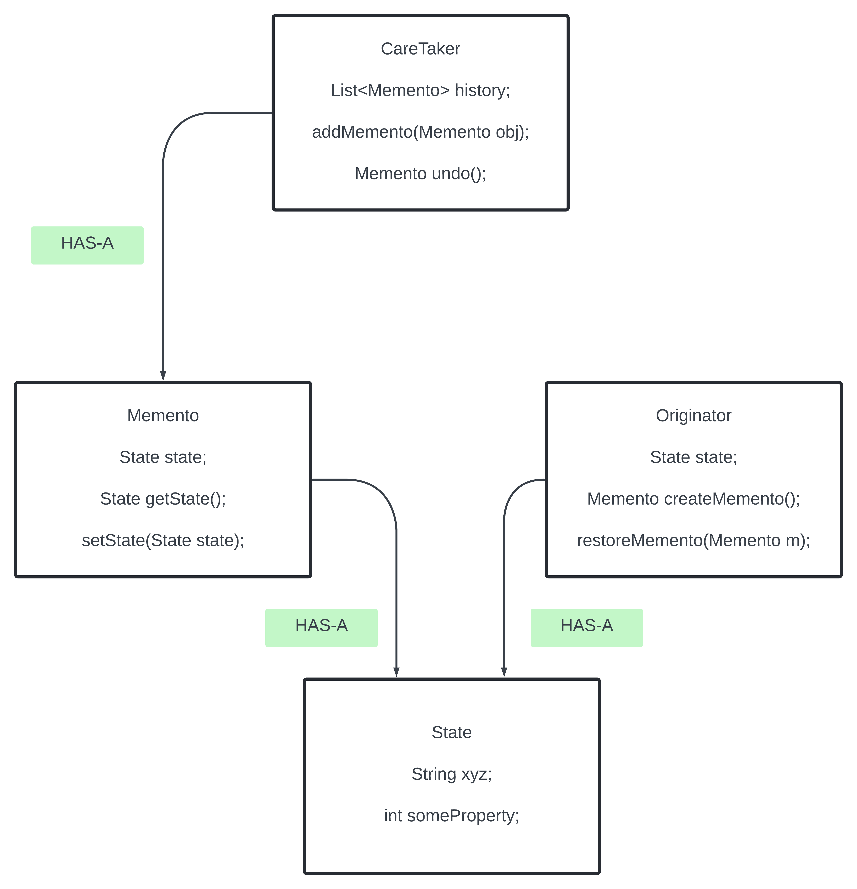

This pattern is mainly used to store the Object history. Like to do the **UNDO/REDO** functionality without exposing the objects internal state and breaking encapsulation.

It is also called as Snapshot Design Pattern.

We want we can keep the snapshot and whenever we want we can revert back to that state.

Memento Design Pattern has 3 major category.
**Originator** - It represents the object for which the state needs to be saved and restored. 
It represents the object which we need to save.
Exposed methods to Save and Restore its state using memento object.
**Memento** - It represents an object which holds the state of the Originator.
**Caretaker** - Manages the list of state.


Originator has what to save in the memento and what to restore in the memento.




Example - A application like TextEditor and the user will be able to add the change and update and undo. The user should be able to add the change and revert to the previous state.

In the problematic code.

```java
public class TextEditor{
    private String text;

    public void write(String text) {
        this.text = text;
    }
    public String getContent() {
        return text;
    }
}

public class TextEditorMain {

    public static void main(String[] args) {

        TextEditor editor = new TextEditor();
        editor.write("Hello World.");
        editor.write("Hello Everyone.");
        System.out.println(editor.getContent());
    }
}
```

The output of the code is `Hello Everyone` The issue is there is no way to revert back to the first text like `Hello World`.

The next step to think like storing the text in Stack meaning the Hello World in stack then st.push the next. The undo will show the top element.

The issue will redo like getting it back then need 2 stack. Memory limit exceed is another issue. It breaks the SRP as teh TextEditor is storing the history. The State management is the history and it should be in a separate class.


The Momento Design pattern.

There will be a class like the `Momento` and it will capture the internal state of the editor. 

Momento Class - Stores the internal state of the editor.

```java
public class EditorMemento {
    private final String content;
    public EditorMemento(String content) {
        this.content = content;
    }
    public String getContent() {
        return content;  // The content is the internal state of the editor that we want to save and restore.
    }
}
// The content is captured and it will not change.
```

The `Caretaker` class store the history of the editor. It has the single responsibility of managing the state or the momento.

**Summary -**
**Originator** - The object whose state needs to be saved and restored (Editor).  
**Memento** - Captures and stores the internal state of the originator (Editor Memento).  
**CareTaker** - Manages and stores the mementos without modifying the content (CareTaker).

Application - Undo/Redo Application - Text editor, drawing apps, game to load or reload games state.

See the notes and the better code.