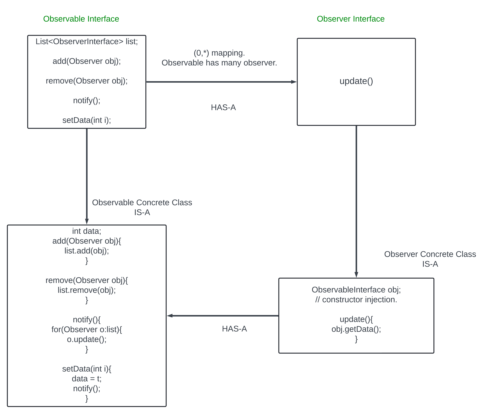
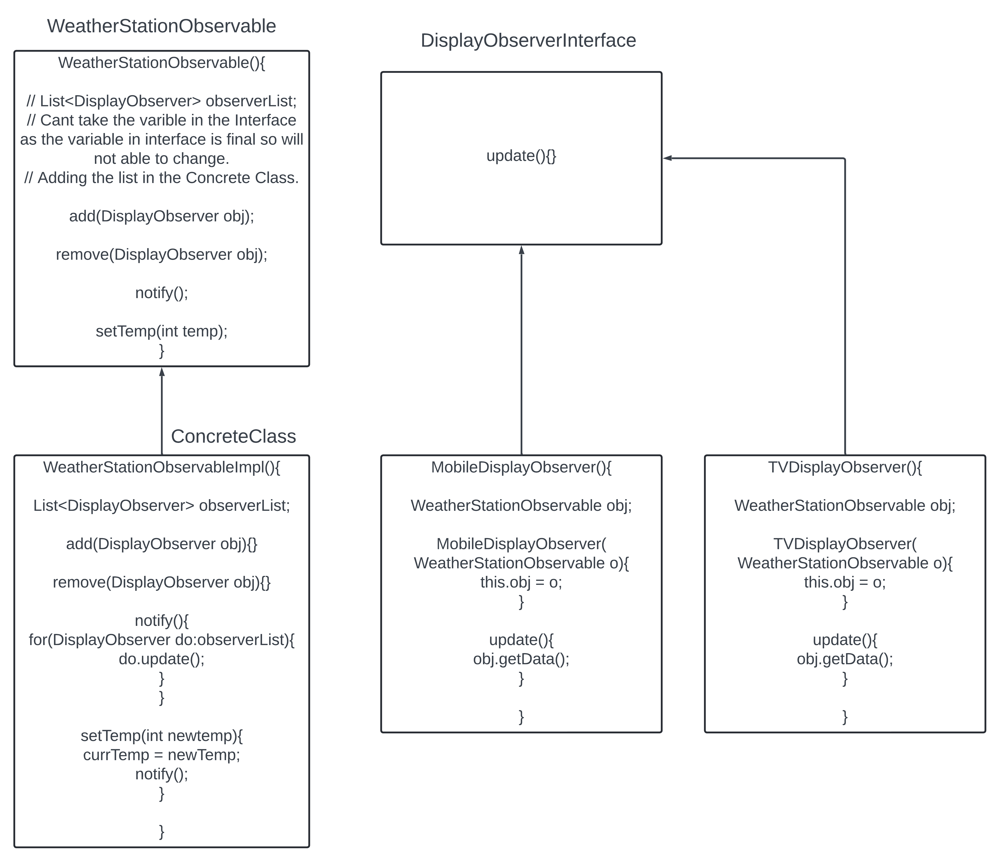

Interview in Walmart.

In amazon for any product if it is out of stock then there is a button called Notify Me. Whenever the product will be available then the customer who has clicked in the Notify Me button will get the message.

Implement the Notify Me button.

In observer design pattern we have 2 objects `Observable` and `Observer` 
Whe there is any state change in the Observable then it will update to all the Observer.
There are multiple Observer who is following the Observable.


First is `Observable Interface`. It has the method add (also known as registration used to add the observer name to the observable interface), remove and notify. 
Another `Observer` interface. it has the update method.

In the add method will add teh Observer.`add(Observer obj);`
Same for the remove will remove the Observer. `remove(Observer obj);`
In notify will send notify to the observer that are added and we store in the list. List contains the observer. `List<ObserverInterface>`

**When implements Interface, making concrete class of teh interface it is IS-A** and **when we use the interface for any list or anything then HAS-A**.



The update method has no parameter.
One way where we pass the observable interface in the parameter in the ObservableConcreteClass and get the update in the ObserverConcreteClass and mention as an instance of the ObservableConcreteClass as there will be multiple concrete class for the observable.
Another way(HeadFirstDesignPattern) we pass the ObservableInterface in the constructor injection of the ObserverConcreteClass. Whenever there will be an update we can get the notify.

### Example.
Weather Station. It needs to update the current temperature every 5 mins. The weather is getting observed by `TVDisplayObserver` and `MobileDisplayObserver`

How to solve.



If we donot take the constructor Injection then we have to pass the object in the parameter and also we have to mention like instance of as TVObserver can look to weatherStationObservable and it can also watch to the CricketStationObservable. 

Now that we have the weatherStationObservable as the constructor injection so for every update the update method will be called.
```java
MobileDisplayObserver(WeatherStationObservable o){
this.obj = o;
}
```
When we need CricketStationObservable then will pass it in the constructor.

### Example 2
Notify Me button.
In the StockObservable we have Iphone Impl. In the observer we have NotificationAlertObserver where we have two class one for the EmailObserver and another one for the MessageObserver. People can use the email or the message.


One doubt is the Stock Market Exchange also uses the Observer Design Pattern.