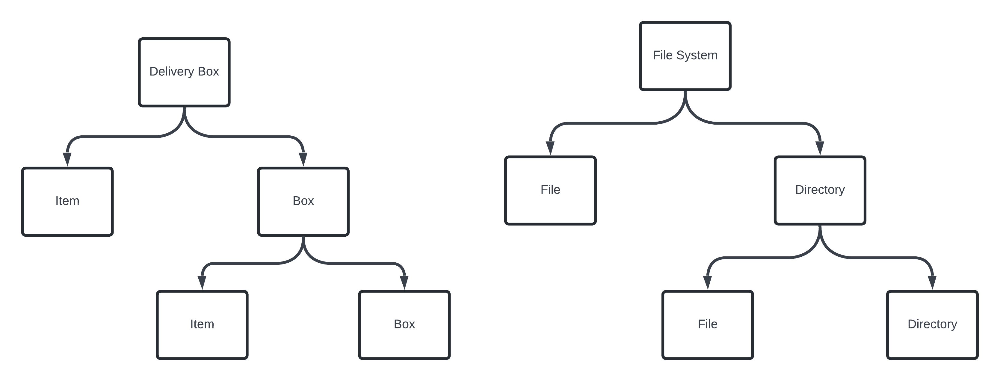
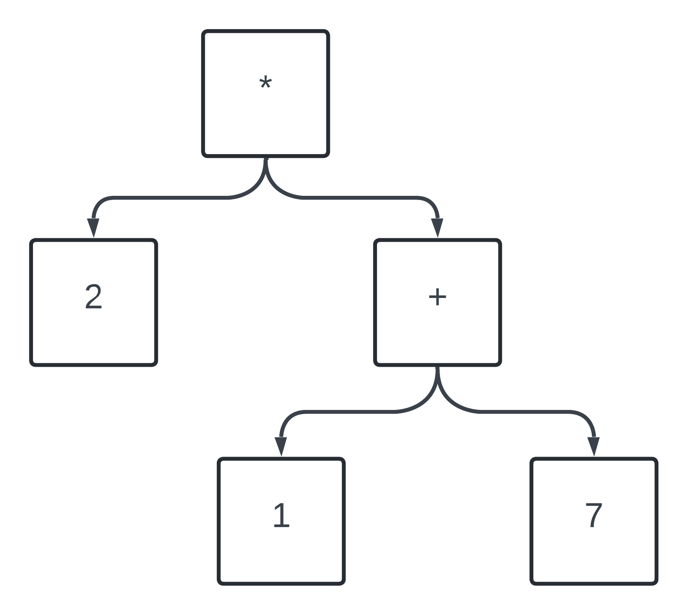

Composite Design Pattern.

File system and Calculator.
Object inside object. Like one bigger object that has another object. 
When the object create a tree like structure.
Then we use Composite Design Pattern.

In the code we can see that we have to put the typecasting and if else for the check of the object.

### How it solves.
First the interface of FileSystem. There we have 2 class File and another Composite Object.

The directory is implementing the FileSystem and also has the file system list. It is one to many relationship.

### Example 1.
Calculator and solve the expression 2*(1+7) Say for the addition we can make the separate object and solve using the Composite Design Pattern.
