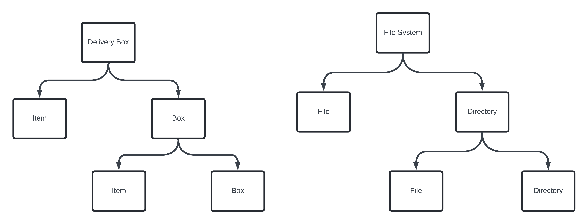
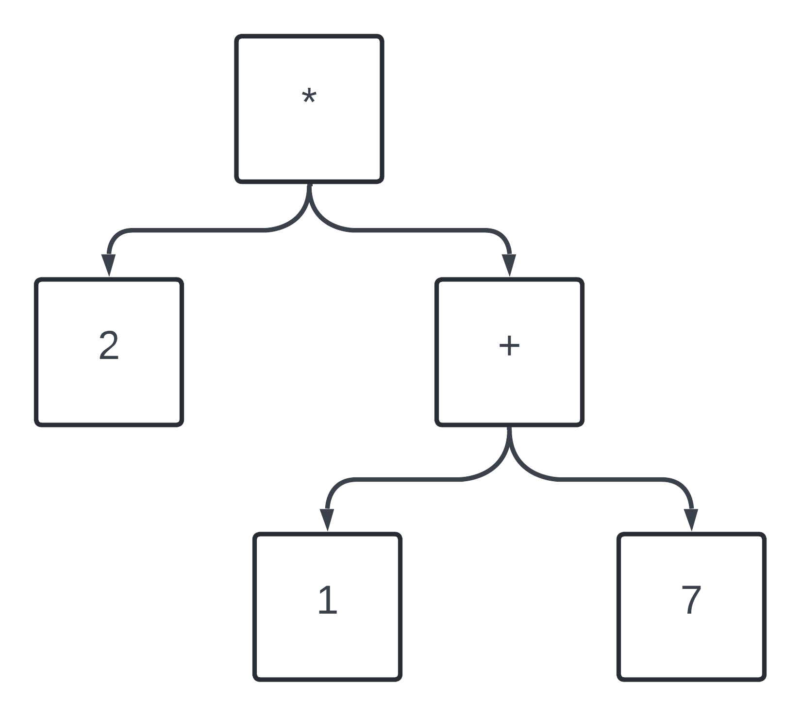

Composite Design Pattern.

File system and Calculator.
Object inside object. Like one bigger object that has another object. 
When the object create a tree like structure.
Then we use Composite Design Pattern.

In the code we can see that we have to put the typecasting and if else for the check of the object.

### How it solves.
First the interface of FileSystem. There we have 2 class File and another Composite Object.

The directory is implementing the FileSystem and also has the file system list. It is one to many relationship.

### Example 1.
Calculator and solve the expression 2*(1+7) Say for the addition we can make the separate object and solve using the Composite Design Pattern.

The pattern is used when there is a hierarchies.

There is a file directory and it has files and folder and working with the standard object hierarchies is complex.

The composite pattern allows to treat **individual object** and the **composition of object** uniformly by representing part-whole hierarchies.

The File system has the move() method and moving an individual file and a folder will be difficult so the pattern makes it easy.

The Folder class is not correct as there is no way to store the List<Folder> or List<List<Folder>>

The solution is to make a FileSystem component. The folder class will store private List<FileSystemComponent> files = new ArrayList<>(); meaning it will tag the interface and both file and folder uses the interface so there is no issue of any.
