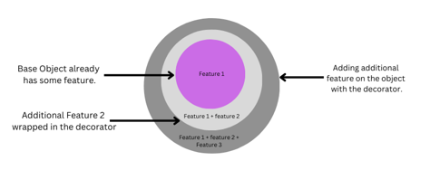
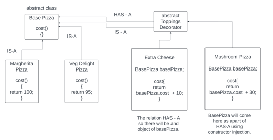

There is a base object and we want to add one feature on top of the base object. This is also going to be an object.

We can add more feature on top of these object and it can continue.

Individually all are object and we add feature on top of it.

Example - Base Car. 
Feature 1 = Base Car + AC.
Feature 2 = Base Car + AC + Seat Cover.
Feature 3 = Base Car + AC + Seat Cover + Sunroof.
We can add as many features on top of the object.

Example - Base Pizza.
Feature 1 = Margherita (Base) + Cheese.
Feature 2 = Veg Delight(Base) + Extra Veggies.
### Why we need Decorator Pattern.
Class Explosion.
In this case we will keep on making new class and also we have to make more classes for all the combinations. Too many class will be difficult to handle. Like one class for Base Pizza. One class for the feature 1.

### How the decorator pattern solves the problem.
Here we make one base abstract class. One decorator abstract class. The decorator is also and object so it HAS-A base object. The topping is also an object so it IS-A base object.

Inheritance IS-A extends.