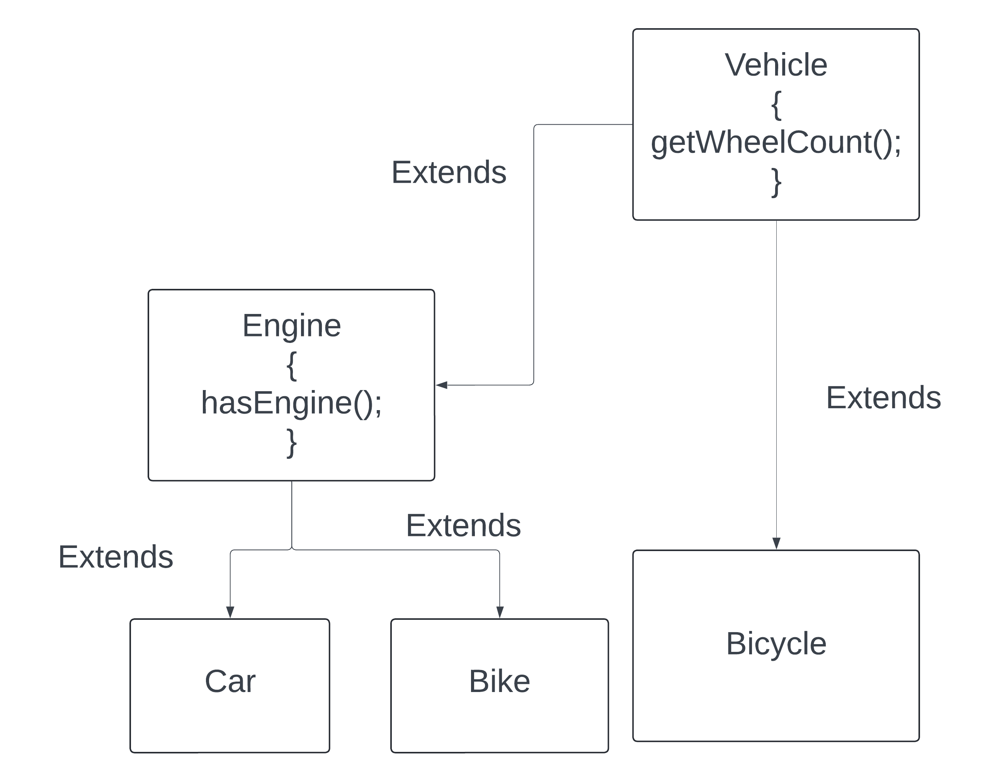

LiskovSubstitutePrinciple.

If we substitute the parent or child object then we should not break the code.
Meaning one child should not downsize the property of the parent class.

In the code it is working fine for the Vehicle and Car and Bike. All of them has engine and wheel.
Now when we make the Bicycle then we cannot have the engine.
```java
public class Bicycle extends Vehicle{
    @Override
    public Boolean engine(){
        return null;
    }
}
```
This is wrong.


We should not downsize the properties.

### How to solve the issue?
Only add those functionalities which is available to all the children. In the vehicle we will not add the engine.
Will make separate engine class and the other child will extend the engine.



Here we are not able to call the hasEngine() method from the list of Vehicle as Vehicle does not have the method.
Similarly, if we create a list of Engine then we cannot make the bicycle object as it does not extend engine class.
SO will not get any error.
