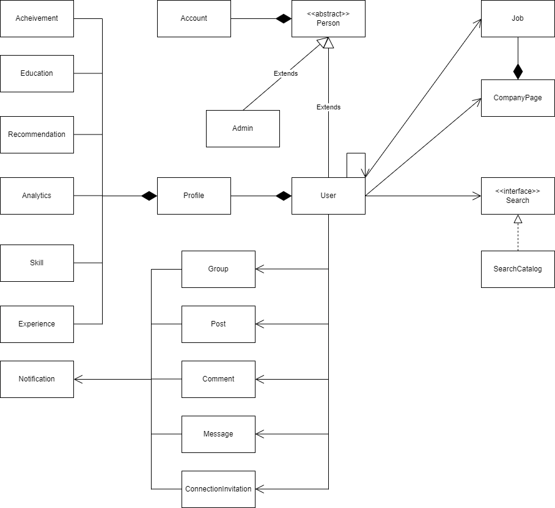

The Class Diagram od the Linkedin.

Person is an abstract class and it is used for the user and the admin.

Profile class will contain all the important information of the user. Profile has composition relationship with all the user details.

User can be associated with Company(current) , company page (follow), can follow, connect, recommend another user, group, posts, comments. There is an association relation with the User. This is one way association only user can associate with post.

Search is an interface as there can be different types of search.