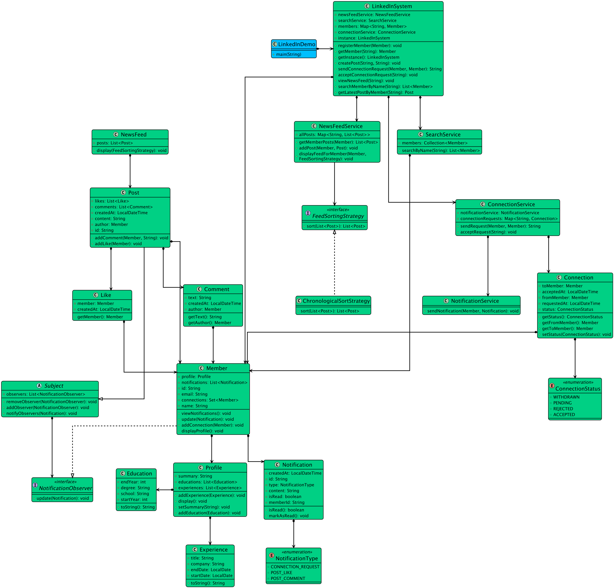

# Design Linkedin System.

**Profile.**  
User profile information like profile picture, headline, summary, experience, education and skills.  
User should be able to update the information.

**Connection.**  
Send, accept or decline connection request.  
User should be able to view the list of connections.

**Messaging.**  
Send message to connection.  
View the inbox and sent message.

**Job Posting.**  
Employers post the job with title, description, detail and location.  
User should be able to view and apply to the job.

**Search**.  
User should be able to search for other user, company, job posting.  
Search result should be ranked based on relevance and user preference.

**Notification.**  
User should get notification for each events like connection request, message and job posting.  
Notifications should be delivered in real time.

**Scalability and Performance**.  
The system should be designed to handle large number of concurrent users and high traffic load.  
The system should be scalable and efficient in terms of resource utilization.

### Core Entities.  
LinkedInService - Main class that manages users, connections, job posting, messages.   
Fields - List users, List jobPostings, List connections, List notification.   
Methods - registerUser(User), adddConnection(User, User), postJon(jobPosting), sendMessage(User, User, String), sendNotification(Notification), searchUsers(String), searchJobs(String).

User - Represents a user with profile, connections, messages and notifications.  
Fields - int id, String name, Profile profile, List connections, list messages, List notifications.  
Methods - sendConnectionRequest(User), acceptConnection(Connection), sendmessage(User, String), addSkills(Skill), addEducation(Education),addExperience(Experience).

Profile - Include education experience and skills.  
Fields - List skills, List education, List experience.

Connection class - Connection between two users.   
Fields - int id, User user1, User user2, boolean isAccepted.

JobPosting class - Represents a job posted by a user or company.  
Fields - int id, String title, String description, User postedBy.

Message class - Represents a direct message between users.  
Fields - int id, User sender, User receiver, String content.

Notification class - Sent to the user.  
Fields - int id, User recipient, String message, NotificationType type.

NotificationTYpe Enum - Type of notification CONNECTION_REQUEST, JOB_MATCHING, MESSAGE.  

Skill class - Skill in users profile.   
Fields - String name.

Education - Education entry in user profile.  
Fields - String institution, String degree, String fieldOfStudy, int startYear, int endYear.

Experience - Experience in users profile.  
Fields - String company, String title, int startYear, int endYear.

### Todo - Concurrency.

