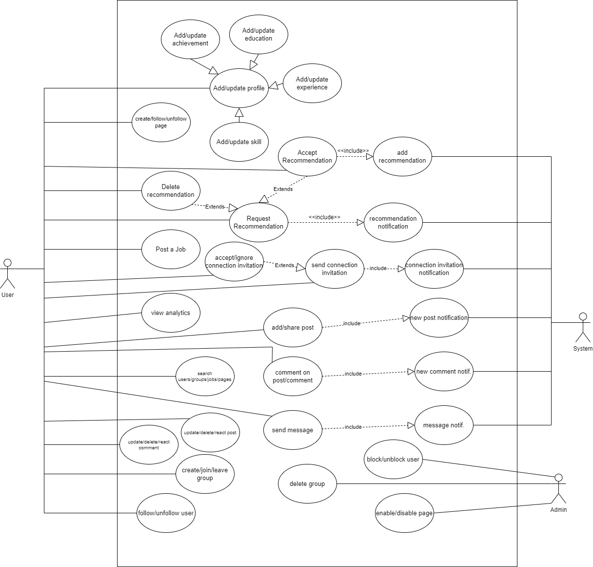

# Use-case Diagram

## Actors of the system.

## Primary
### User
1. Create a profile with professional information.
2. Generate content through posts.
3. Apply for job opportunities.
4. Follow relevant pages and join groups for networking.
5. Engage with other users by sending connection invitations, messaging, and commenting on posts.

### Admin
1. Blocking or unblocking users.
2. Enabling or disabling pages.
3. Deleting existing groups.
4. Overseeing various other operational tasks.

## Secondary Actors

### System
1. Sends notifications for new connection requests.
2. Alerts users to incoming messages.
3. Notifies about comments on posts.
4. Provides updates on posts.
5. Delivers recommendations and other alerts.

### Use-cases of User
1. **Add/Update Profile**: Add details like education, experience, skills, and achievements or update an existing Lprofile.
2. **Follow/Unfollow User**: Follow or unfollow other users.
3. **Send Message**: Send messages to other users.
4. **Send Connection Invitation**: Send a connection request to other users.
5. **Accept/Ignore Connection Invitation**: Accept or ignore connection requests from other users.
6. **Create/Follow/Unfollow Page**: Create a new page or update, delete, follow, or unfollow an existing page.
7. **Create/Join/Leave Group**: Create a new group, or join or leave an existing group.
8. **Add/Share Post**: Add a new post or share an existing one.
9. **Update/Delete/React to Post**: Update, delete, or react to a post.
10. **Comment on Post/Comment**: Comment on a post or on an existing comment.
11. **Update/Delete/React to Comment**: Update, delete, or react to a comment.
12. **Search Users/Groups/Pages/Jobs**: Search for users, groups, pages, or job listings.
13. **Post a Job**: Post job listings on the page.
14. **View Analytics**: View analytics such as the number of connections, post impressions, profile views, and search appearances.
15. **Request Recommendation**: Send a recommendation request to other users.
16. **Accept Recommendation**: Accept a recommendation request from another user.
17. **Delete Recommendation**: Delete a recommendation request from another user.

For a particular user we will only focus on the use case of the user.

## Use case of Admin.

1. **Block/Unblock User.**
2. **Enable/Disable Page.**
3. **Delete Group** - Remove an existing group.

### Use-cases of System
1. New Post Notification: Send notifications when new posts are published.
2. New Comment Notification: Notify users when another user comments on their posts or
      comments.
3. Connection Invitation Notification: Alert users to new connection invitations.
4. Message Notification: Inform users of new messages.
5. Recommendation Notification: Notify users when a recommendation is requested.
6. Add Recommendation: Add recommendation to the profile.

Here System is the secondary which will fulfill the main Linkedin System use cases.

### Relationships: Generalisation

-In this section, we outline the connections and interactions between actors and their respective use cases.

1. The user has the ability to add or update their profile by incorporating changes to their education, experience, skills, or achievements.
2. This indicates that the "Add/Update Profile" use case is a generalisation of the "Add/ Update Education," "Add/Update Experience," "Add/Update Skill," and "Add/Update Achievement" use cases.

### Relationships: Include

A. The "Send message" use case includes the "Message notification" use case because users are notified whenever they receive a message.
B. The "Send connection invitation" use case includes the "Connection invitation notification" use case, as the system notifies users upon receiving a connection invitation.
C. The "Accept recommendation" use case includes the "Add recommendation" use case because when a user accepts a recommendation request, the system automatically adds that recommendation to the user's profile.
D. The "Add/share post" use case includes the "New post notification" use case; whenever a user creates or shares a post, the system notifies connected users.
E. The "Comment on post/comment" use case includes the "New comment notification" use case, which triggers a notification to the user whenever a new comment is made on their post or a followed post.
F. The "Request recommendation" use case includes the "Recommendation notification" use case, alerting users whenever they receive a recommendation request.

### Relationships: Extend.

• When users receive a recommendation request, they have the option to either accept or delete it. As a result, the "Request recommendation" use case extends both the "Accept recommendation" and "Delete recommendation" use cases.
• When users receive a connection invitation, they can choose to either accept or ignore it. Thus, the "Send connection invitation" use case extends the "Accept/ignore connection invitation" use case.

Extend means one use case extends other and it is optional.
The Usercase diagram is attached.

