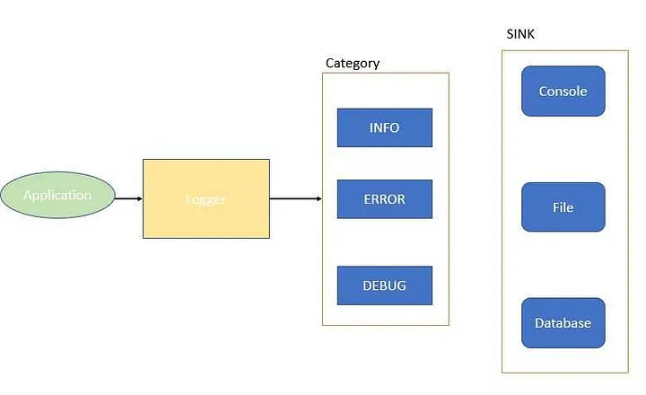

## LLD of Logging Framework Log4j.

It should be able to log in more than one place like console, log file, database.  
It should be able to log multiple category of messages like INFO, DEBUG, ERROR.

The category and place of logging should be configurable. The logging can be configured from the property file.

### Component

**Logger** - It will be exposed to the application. It will be used to write the log.  
**Category** - It should be selected at run time based on parameter. When it is debug it should not show anything above debug.  
**Sink** - It should be selected at run time based on some parameter. It can be console, file or database.

Relate the design pattern.

Creational Design Pattern.

Console class, File Class, Database class.  
Class Logger.  
Class Category.

Logger is singleton and only one object should be created.

When multiple object created in multi thread then it will write multiple logs in multiple files.

The sink like the console, file and database can be made on the fly using factory.

Structural pattern in the system - There is no connection in the system. Just one connection flowing from logger to sink. No two class needs to be coupled or bridged between each other.

Behavior - Category and sink are important in behavior. There is multiple kind of sink and multiple kind of category.

The category can be of multiple type. The type are more restrictive than other like the error is more restrictive than the info. When set to info then we should not show the error or debug. There is a heirarchy in the system.  
Here the chain of responsibility principle can be used.
The sink - There are multiple system which are independent to each other and they are dependent on the logging system. The sink are dependent on the category and it is observer design.

Singleton design.

```java
public class Logger implements Clonable, Serializable{
    private volatile static Logger logger;
    private volatile static AbstractLogger chainOfLogger;
    private Logger(){
        if(logger!=null){
            throw new IllegalStateException("Object already created");
        }
    }
    public static Logger getInstance(){
        if(logger==null){
            synchronized(Logger.class){
                if(logger==null){
                    logger=new Logger();
                    chainOfLogger = buildChainOfLogger();
                }
            }
        }
        return logger;
    }
    protected Object clone() throws CloneNotSupportedException{
        throw new CloneNotSupportedException();
    }

    protected Object readResolve(){
        return Logger;
    }
    void createLog(int level, String msg){
        chainOfLogger.logMessage(level,msg);
    }
    public void info(String msg){
        createLog(1,msg);
    }
    public void error(String msg){
        createLog(2,msg);
    }
    public void debug(String msg){
        createLog(3,msg);
    }
}
```

The chain of responsibility.

```java
public abstract class AbstractLogger{
    int level;
    // It will show the level of logging like info is 1 and error say 2 and debug say 3.
    // When level is 3 then it should print all like infor, error and debug.

    // Set the next logging level.
    AbstractLogger nextLoggingLevel;
    public void setNextLoggingLevel(AbstractLogger nextLoggingLevel){
        this.nextLoggingLevel = nextLoggingLevel;
    }

    // Use the next logging level.
    // The chain of responsibility.
    void logMessage(int level, String msg, LogSubject logSubject){
        if(this.level<=level){
            display(msg, logSubject);
        }
        if(nextLoggingLevel != null){
            // Use the nextLoggingLevel.
            nextLoggingLevel.logMessage(level,msg, logSubject);
        }
    }
    protected abstract void display(String msg, LogSubject logSubject);
}
```

Concrete class to display the message.

```java
class InfoLogger extends AbstractLogger{
    public InfoLogger(int level){
        this.level = level;
    }
    @Override
    protected void display(String msg, LogSubject logSubject){
        String message = "INFO - "+ msg;
        logSubject.notifyAllObserver(1,message);
        System.out.println(message);
    }
}
```

```java
class ErrorLogger extends AbstractLogger{
    public ErrorLogger(int level){
        this.level = level;
    }
    @Override
    protected void display(String msg, LogSubject logSubject){
        String message = "ERROR - "+ msg;
        logSubject.notifyAllObserver(2,message);
        System.out.println(message);
}
```

```java
class DebugLogger extends AbstractLogger{
    public DebugLogger(int level){
        this.level = level;
    }
    @Override
    protected void display(String msg, LogSubject logSubject){
        String message = "DEBUG - "+ msg;
        logSubject.notifyAllObserver(3,message);
        System.out.println(message);
}
```

The Logger class instance is created then we have to use the abstract logger to log at various level.

LogManager takes the chainOfResponsibility to buildChainOfLogger.

```java
public class LogManager{
    protected static AbstractLogger buildChainOfLogger(){
        AbstractLogger infoLogger = new InfoLogger(1);
        AbstractLogger errorLogger = new ErrorLogger(2);
        AbstractLogger debugLogger = new DebugLogger(3);

        infoLogger.setNextLoggingLevel(errorLogger);
        errorLogger.setNextLoggingLevel(debugLogger);

        return infoLogger;
    }
}
```

The application main class.

```java
public class Application{
    public static void main(String args[]){
        Logger logger = Logger.getInstance();
        logger.info("This is info.");

        logger.error("This is error.");
        // Only the error is giving the messga eof error and info. Error has more priority than info.
    }
}
```

The sink will be using the Observer design pattern.

There are main component subject te changing part and the observer part.

```java
public class LogSubject{
    List<LogObserver> logObserver = new ArrayList<>();
    // Adding new observer, removing observer and notify observer.
    // Removing the observer can be done by the config file. The main one are the add and notify.
    Map<Integer, List<LogObserver>> logObservers = new HashMap<>();
    void addObserver(int level, LogObserver logObserver){
        // Adding the Observer in the map.
        // Integer is the level which it is logging.
        // Adding need two input like which part I have to add the observer and the level.
        List<LogObserver> logObserversList = logObservers.getOrDefault(level,new ArrayList<>());
        logObserversList.add(logObserver);
        logObservers.put(level,logObserversList);
    }
    void notifyAllObserver(int level, String msg){
        for(Map.Entry<Integer, List<LogObserver>> entry:logObservers.entrySet()){
            if(entry.getKey()==level){
                entry.getValue().forEach(observer -> observer.log(msg));
            }
        }
    }
}
```

```java
interface LogObserver{
    void log(String message);
}
```

```java
public class ConsoleLogger implements LogObserver{
    @Override
    public void log(String msg){
        System.out.println("CONSOLE - "+msg);
    }
}
```

```java
public class FileLogger implements LogObserver{
    @Override
    public void log(String msg){
        System.out.println("FILE - "+msg);
    }
}
```

The logger class will have the subject and based on the subject it will have the observer.

```java
public class Logger implements Clonable, Serializable{
    private volatile static Logger logger;
    private volatile static AbstractLogger chainOfLogger;
    private volative static LogSubject logSubject;
    private Logger(){
        if(logger!=null){
            throw new IllegalStateException("Object already created");
        }
    }
    public static Logger getInstance(){
        if(logger==null){
            synchronized(Logger.class){
                if(logger==null){
                    logger=new Logger();
                    chainOfLogger = buildChainOfLogger();
                    logSubject = buildSubject();
                }
            }
        }
        return logger;
    }
    protected Object clone() throws CloneNotSupportedException{
        throw new CloneNotSupportedException();
    }

    protected Object readResolve(){
        return Logger;
    }
    void createLog(int level, String msg){
        chainOfLogger.logMessage(level,msg,logSubject);
    }
    public void info(String msg){
        createLog(1,msg);
    }
    public void error(String msg){
        createLog(2,msg);
    }
    public void debug(String msg){
        createLog(3,msg);
    }
}
```

The buildSubject will be set in the logManager class.

```java
public class LogManager{
    protected static LogSubject buildSubject(){
        LogSubject logSubject = new LogSubject();
        ConsoleLogger consoleLogger = new ConsoleLogger();
        FileLogger fileLogger = new FileLogger();

        logSubject.addObserver(1,consoleLogger);
        // The level 1 message is in console Logger.
        logSubject.addObserver(2,fileLogger);
        return logSubject;
    }
}
```

We can see in the application and see the output.

https://www.lldcoding.com/design-logging-library-like-log4j-machine-coding

https://www.digitalocean.com/community/tutorials/log4j2-example-tutorial-configuration-levels-appenders